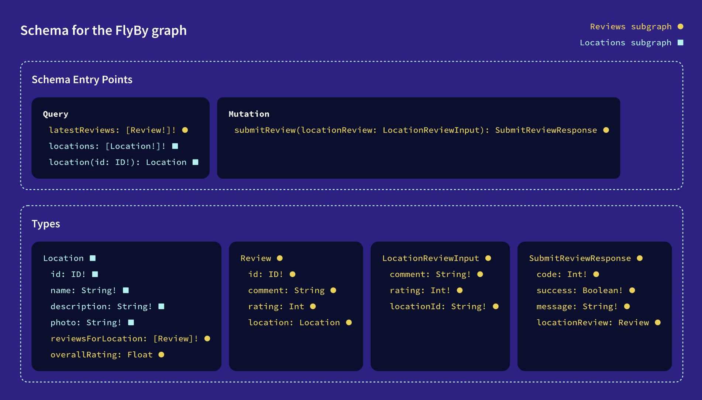

1) Установить rover
```bash
curl -sSL https://rover.apollo.dev/nix/latest | sh
```
2) Собрать суперграф схему
```bash
rover supergraph compose --config ./supergraph.yaml --output supergraph.graphql
```
